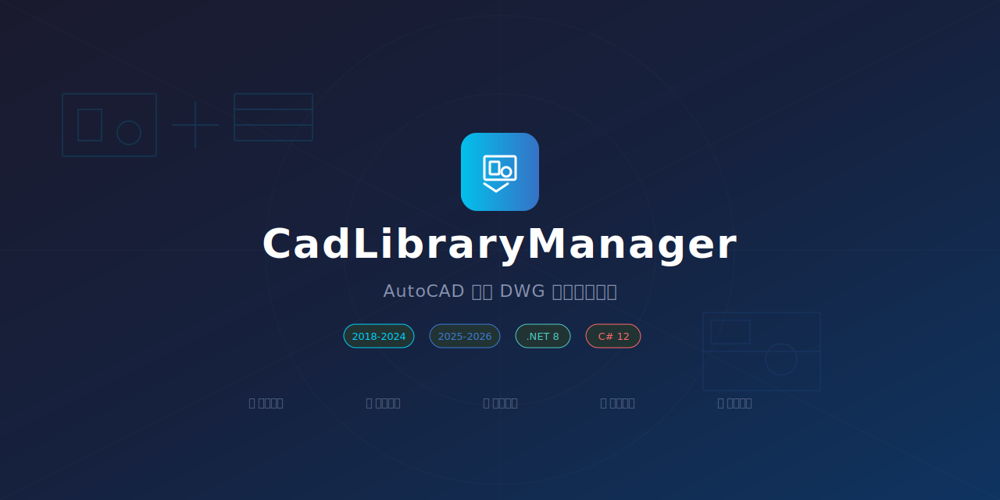
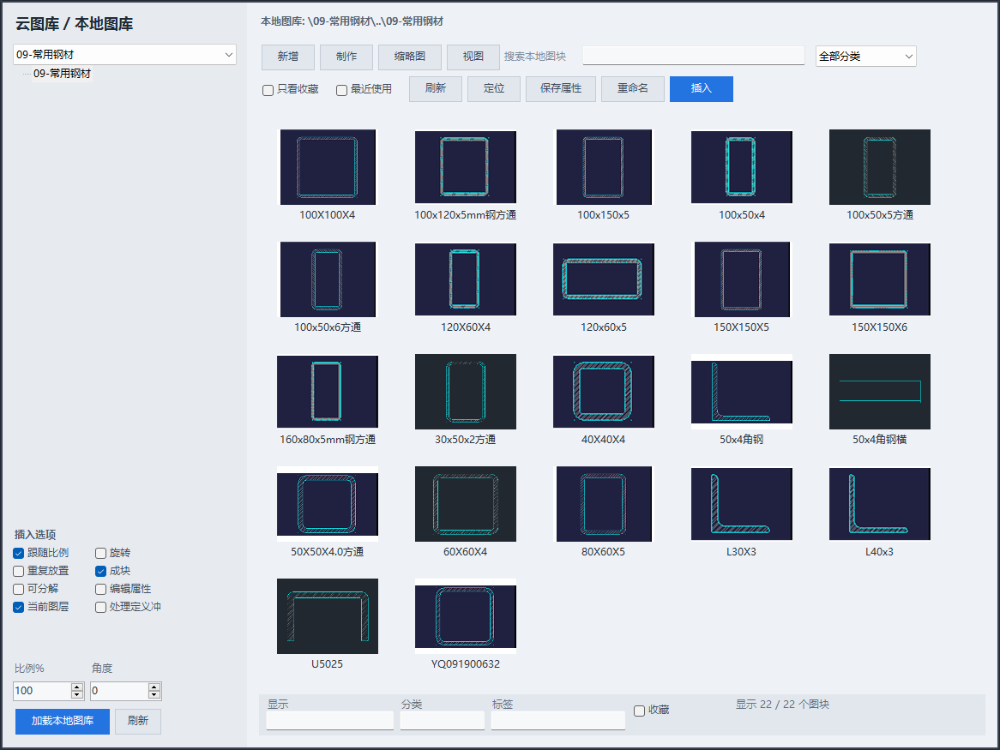

<p align="center"></p>

# CadLibraryManager

> AutoCAD 本地 DWG 图库管理插件 — 浏览、搜索、分类、一键插入图块

[]()
[]()
[]()
[]()



## 项目简介

CadLibraryManager 是一个 CAD 本地 DWG 图库管理插件，用来把常用型钢、节点、构件图块整理成可浏览、可搜索、可收藏、可一键插入的图库面板。插件在 CAD 内通过命令 `W1` 打开，支持本地目录扫描、缩略图预览、分类标签、收藏筛选、属性保存、比例/角度/图层插入选项。

## 功能特性

| 功能 | 说明 |
|------|------|
| 📂 图库浏览 | 递归扫描目录，树形文件夹 + 缩略图网格 |
| 🔍 搜索筛选 | 按名称、分类、标签实时搜索 |
| ⭐ 收藏管理 | 一键收藏常用图块，支持只看收藏 |
| 🏷️ 元数据 | 显示名称、分类、标签，LiteDB 本地存储 |
| 🖼️ 缩略图 | 读取 DWG 内置预览图，支持手动生成 PNG |
| 📥 批量导入 | 批量选择外部 DWG 复制到图库目录 |
| ✏️ 重命名 | 重命名 DWG 文件并同步元数据 |
| 🧩 图块插入 | Jig 交互指定插入点，支持比例/旋转/图层 |
| 🔄 连续插入 | 勾选后可连续放置同一图块 |
| 💣 解析插入 | 可选将图块炸开为独立图元 |

## 支持版本

| CAD 平台 | 版本 | 框架 | 安装包目录 |
|---------|------|------|------------|
| AutoCAD | 2018 - 2024 | .NET Framework 4.8 | `AutoCAD 2018-2024 (net48)` |
| AutoCAD | 2025 - 2026 | .NET 8.0 | `AutoCAD 2025-2026 (net8.0)` |
| 浩辰 CAD / GstarCAD | 2026 | .NET 8.0 | `浩辰CAD-GstarCAD` |

## 快速开始

### 方式一：使用发布包一键安装（推荐）

下载或复制发布包后，先进入与你的 CAD 版本对应的目录：

```text
cad图库管理器/
├── AutoCAD 2018-2024 (net48)/
├── AutoCAD 2025-2026 (net8.0)/
└── 浩辰CAD-GstarCAD/
```

AutoCAD 2018-2024：

```powershell
cd "AutoCAD 2018-2024 (net48)"
powershell -ExecutionPolicy Bypass -File ".\一键安装AutoCAD 2018-2024版.ps1"
```

AutoCAD 2025-2026：

```powershell
cd "AutoCAD 2025-2026 (net8.0)"
powershell -ExecutionPolicy Bypass -File ".\一键安装AutoCAD 2025-2026版.ps1"
```

浩辰 CAD / GstarCAD：

```powershell
cd "浩辰CAD-GstarCAD"
powershell -ExecutionPolicy Bypass -File ".\一键安装浩辰CAD版.ps1"
```

安装完成后重启 CAD，在命令行输入：

```text
W1
```

即可打开“云图库 / 本地图库”面板。

### 安装时发生了什么

AutoCAD 版本会安装到当前用户的自动加载目录：

```text
%APPDATA%\Autodesk\ApplicationPlugins\CadLibraryManager.bundle\
├── PackageContents.xml
└── Contents\Windows\
    ├── CadLibraryManager.dll
    └── 依赖 DLL
```

浩辰 CAD / GstarCAD 版本会安装插件文件，并写入 GstarCAD 的自动加载注册表项：

```text
%APPDATA%\Gstarsoft\GstarCAD\ApplicationPlugins\CadLibraryManager.GstarCAD\
```

如果浩辰安装脚本提示没有找到 GstarCAD 注册表配置，请先启动一次浩辰 CAD，然后重新运行安装脚本。

### 方式二：从源码自动安装

```powershell
powershell -ExecutionPolicy Bypass -File tools\install-autoload.ps1
```

脚本会自动查找 AutoCAD 安装目录、编译项目、安装到 `.bundle` 目录。重启 AutoCAD 后输入 `W1` 即可。

### 方式三：手动加载

```powershell
# 编译
dotnet build CadLibraryManager.csproj -c Release

# 在 AutoCAD 中执行
NETLOAD → 选择 bin\Release\net8.0-windows\CadLibraryManager.dll
W1      → 打开图库面板
```

### 方式四：手动安装到 .bundle

```
%APPDATA%\Autodesk\ApplicationPlugins\CadLibraryManager.bundle\
├── PackageContents.xml
└── Contents\Windows\
    ├── CadLibraryManager.dll
    └── LiteDB.dll
```

## 编译

需要 AutoCAD API DLL（`AcMgd.dll`、`AcDbMgd.dll`、`AcCoreMgd.dll`）：

```powershell
# AutoCAD 2026（默认路径）
dotnet build CadLibraryManager.csproj -c Release

# 指定 AutoCAD 安装目录
dotnet build CadLibraryManager.csproj -c Release -p:AutoCADInstallDir="C:\Program Files\Autodesk\AutoCAD 2025"

# AutoCAD 2018-2024（需要对应版本 API DLL）
dotnet build CadLibraryManager.CAD2020.csproj -c Release -p:AutoCADInstallDir="C:\Program Files\Autodesk\AutoCAD 2020"
```

## 使用说明

1. 执行命令 `W1` 打开图库面板
2. 点击 **目录** 选择 DWG 图库文件夹
3. 左侧树形浏览文件夹，右侧显示缩略图网格
4. 选中图块后设置比例、旋转角度、图层
5. 双击或点击 **插入** → 在图纸中指定插入点

### 元数据字段

- **显示名称** — 列表中展示的名称，可不同于文件名
- **分类** — 按构件类型分组（门窗、节点、家具…）
- **标签** — 逗号分隔，支持多标签搜索
- **收藏** — 星标常用图块，支持快速筛选

### 插入设置

- **比例** — 百分比输入，`100` = 原比例，`50` = 0.5 倍
- **旋转** — 角度制，默认 `0°`
- **图层** — 留空使用当前图层，填写后自动创建不存在的图层
- **连续插入** — 勾选后可反复放置同一图块
- **解析插入** — 将图块炸开为独立图元

## 项目结构

```
CadLibraryManager/
├── src/
│   ├── Commands.cs          # AutoCAD 命令入口 (W1)
│   ├── Plugin.cs            # IExtensionApplication 实现
│   ├── LibraryPalette.cs    # PaletteSet 面板管理
│   ├── LibraryControl.cs    # 主界面 UI（WinForms）
│   ├── BlockInserter.cs     # 图块插入 + Jig 交互
│   ├── BlockMaker.cs        # 选集导出为 DWG 图块
│   ├── DwgPreviewReader.cs  # DWG 缩略图读取/生成
│   ├── LibraryDatabase.cs   # LiteDB 元数据库
│   ├── LibrarySettings.cs   # 配置持久化
│   ├── LibraryItem.cs       # 图库项数据模型
│   ├── LibraryMetadata.cs   # 元数据实体
│   ├── LibraryViewState.cs  # 视图状态持久化
│   ├── InsertOptions.cs     # 插入参数
│   └── PromptText.cs        # 输入对话框
├── bundle/
│   └── PackageContents.xml  # .bundle 自动加载清单
├── installer/
│   ├── Program.cs           # 安装程序（单文件 EXE）
│   └── CadLibraryManagerInstaller.csproj
├── tools/
│   ├── install-autoload.ps1     # 一键安装脚本
│   ├── uninstall-autoload.ps1   # 卸载脚本
│   ├── build-installer.ps1      # 构建安装程序
│   └── build-installer-cad2020.ps1
├── CadLibraryManager.csproj         # net8.0 (AutoCAD 2025-2026)
└── CadLibraryManager.CAD2020.csproj # net48 (AutoCAD 2018-2024)
```

## 数据存储

| 文件 | 位置 | 说明 |
|------|------|------|
| 图库目录配置 | `%APPDATA%\CadLibraryManager\library-folder.txt` | 图库根目录路径 |
| 元数据库 | `%APPDATA%\CadLibraryManager\library.db` | LiteDB 数据库 |
| 视图状态 | `%APPDATA%\CadLibraryManager\view-state.json` | 窗口布局/筛选状态 |
| 缩略图缓存 | 内存 | 按需加载，关闭即释放 |

## 卸载

```powershell
# 卸载自动加载
powershell -ExecutionPolicy Bypass -File tools\uninstall-autoload.ps1

# 删除数据
Remove-Item "$env:APPDATA\CadLibraryManager" -Recurse -Force
```

发布包安装的 AutoCAD 版本也可以直接删除：

```text
%APPDATA%\Autodesk\ApplicationPlugins\CadLibraryManager.bundle
```

浩辰 CAD / GstarCAD 版本卸载：

```powershell
powershell -ExecutionPolicy Bypass -File ".\浩辰CAD-GstarCAD\tools\uninstall-gstarcad-autoload.ps1"
```

## 更新日志

详见 [CHANGELOG.md](CHANGELOG.md)

## 许可证

[MIT License](LICENSE)
